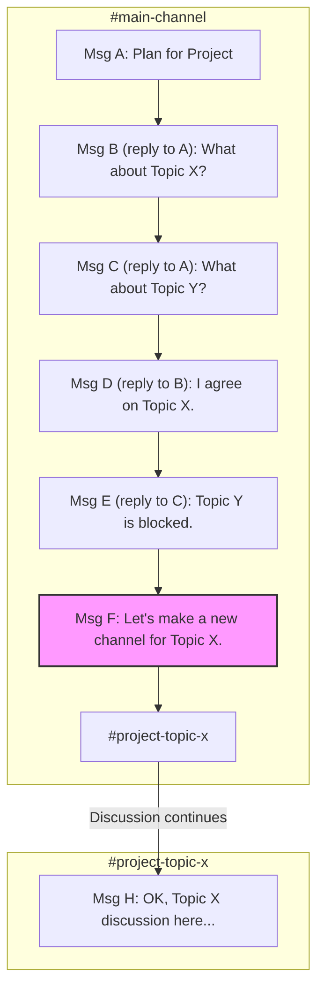

Replying in Slack is non-obvious for new users because its threading model differs fundamentally from other chat apps. While platforms like Discord use a linear, quote-reply flow, Slack sandboxes conversations into threads to maintain channel clarity for asynchronous work. This guide provides workflows for efficient replies and conversation management.

### Workflow Comparison

| Point        | Slack                                                                            | Discord                                                                      |
| :----------- | :------------------------------------------------------------------------------- | :--------------------------------------------------------------------------- |
| **Reply**    | Press `T` or hover to "Reply in thread". Sandboxes reply in a separate pane.       | Click "Reply". Posts a quoted reply in the main channel.                     |
| **Track**    | Automatic. Threads group conversations. Centralized in the "Threads" view.       | Manual. Requires scrolling or searching for mentions.                        |
| **Scan**     | Easy. Main channel shows only top-level posts.                                   | Difficult. Main channel is a mix of posts and all replies.                   |
| **Find**     | Centralized "Threads" view shows all your conversations.                         | Decentralized. Requires searching for `@mentions` across channels.           |
| **Alert**    | Use "Also send to #channel" to notify everyone of a key reply.                   | Use `@everyone` or `@here`.                                                  |
| **Reference**| Use blockquotes (`>`) for context in-thread or paste a message link.             | Reply to the old message; a link back is auto-added.                         |
| **Fork**     | Formal mechanism: "Also send to #channel" forks a reply into a new thread.       | No formal mechanism. Must start a new topic manually.                        |
| **Sub-Reply**| Not supported. Use blockquotes (`>`) to manually create visual hierarchy.        | Not supported. Replies are linear and push to the bottom.                    |
| **Switch**   | Efficient. The "Threads" view acts as an inbox for all active discussions.       | Inefficient. Requires manually navigating channels and scrolling.            |
| **Noise**    | Low by default. Notifications are thread-scoped, reducing interruptions.         | High by default. Notifications are channel-scoped.                           |
| **Onboarding**| Steeper learning curve due to unique threading model.                            | Intuitive, aligns with familiar social chat apps.                              |
| **Mindset**  | Asynchronous work hub. Channels are inboxes; threads are tasks.                  | Real-time social space. Channels are continuous streams of conversation.     |

### Visualizing Complex Conversation Flows

The structural differences between Slack and Discord are most apparent in complex conversations.

#### Slack: Structured Branching

Slack contains conversations in threads. Threads can be forked to new parent messages or moved to DMs, keeping the main channel clean while allowing structured sidebars.

```mermaid
graph TD
    subgraph #main-channel
        A[Message A: "Plan for Project"] --> B{Thread 1};
        D[Message D: Forked from T1.2];
        D --> E{Thread 2};
    end

    subgraph Thread 1 [Thread on Message A]
        B -- "Reply" --> T1_1[T1.1: "What about Topic X?"];
        T1_1 -- "Reply" --> T1_2[T1.2: "Good point. Let's fork this."];
        T1_2 -- "Also send to #channel" --> D;
        T1_1 -- "Reply" --> T1_3[T1.3: "Let's take this offline."];
        T1_3 -- "Move to DM" --> G_DM[DM: Topic X Discussion];
    end

    subgraph Thread 2 [Thread on Message D]
       E -- "Reply" --> T2_1[T2.1: "Continuing Topic X discussion..."];
    end

    style D fill:#f9f,stroke:#333,stroke-width:2px
```

#### Discord: Linear Chaos

Discord processes all messages in a single, chronological flow. Branching a topic requires manually creating a new channel, leading to intertwined discussions in the original channel.



### Standard Reply Workflow: Threads

Use threads for all replies; do not copy message links. The intended methods are faster and replies cannot be retroactively moved into a thread.

*   **Mouse:** Hover over a message. Click the "Reply in thread" icon.
*   **Keyboard:** Select a message with arrow keys. Press `T`.

#### Advanced Thread Management

*   **Use the "Threads" View:** The sidebar's "Threads" view aggregates all followed conversations into a single inbox for efficient tracking.
*   **Follow a Thread:** To monitor a conversation without replying, click the three-dot menu on a parent message and select "Follow thread." This adds it to your "Threads" view without sending a notification.

#### Anti-Pattern: Editing to Reply
Avoid replying in-channel and then editing the message to add an `@mention`. This action does not create a thread, fails to notify thread followers, and clutters the main channel.

### Manual Workflow: Simulating Replies with Links

A manual link-based workflow can simulate replies for users transitioning from other platforms. This method is keyboard-centric and pastes a direct link to the message being replied to.

1.  Navigate between panes (`Ctrl+F6` in the browser) to focus the channel or thread history.
2.  Use arrow keys to select the target message.
3.  Press `L` to copy the message URL to your clipboard.
4.  Navigate back to the message input box.
5.  Paste the URL (`Ctrl+V`) and type your message.

*(Note: This workflow can be further optimized with browser extensions. For example, a power user with a tool like Surfingkeys might use a visual mode shortcut (`v`) to select a message timestamp and then `y` to yank (copy) its URL, achieving the same result with fewer keystrokes. However, be aware that such extensions may override Slack's default keyboard shortcuts.)*

### Managing Branched Conversations in a Thread

Manage context manually when a single thread contains multiple conversational branches, as Slack does not support nested threads.

#### Method 1: Block Quotes

Use blockquotes to reply to a specific, earlier message within the same thread.

1.  Copy text from the message you are referencing.
2.  In the reply box, type `>` followed by a space.
3.  Paste the copied text.
4.  Write your reply on a new line.

This method bundles the context directly with the reply.

#### Method 2: Message Links

Use this to reference a message from a different channel or from much earlier in a long thread. Copy the message link and paste it in your reply. Slack will unfurl it, providing a clickable link to the original context.

### Forking a Thread

Fork a thread when a side discussion evolves into a distinct topic. This moves the conversation into a new parent thread in the main channel.

#### Forking with "Also send to #channel"

To fork a thread, check the "Also send to #channel" box when replying.

1.  In the original thread, type the reply that will start the new topic.
2.  Check the "Also send to #channel" box below the input field.
3.  Send the message.

This action posts the reply as a new parent message in the main channel and notifies **everyone**, not just thread participants. Use this intentionally to surface a key update to the entire channel.

**Keyboard Navigation:** After typing your message, press `Shift+Tab` to focus the checkbox, then `Spacebar` to toggle it. Note that Slack often remembers the state of this checkbox for subsequent replies in the same session, so be mindful of its status.

#### Alternative Forking Methods

Use these when a sub-topic requires a smaller audience or becomes a self-contained project.

*   **Group DM:** For focused discussions (2-4 people). Announce the move in the original thread: "Moving this to a DM with @personA," and paste the original thread link for context.
*   **Temporary Private Channel:** For larger workstreams. Create a new channel (e.g., `#temp-project-feature`), announce the move, and post the original thread link for context.

### Power User Tips for Discord Converts

These tips map common Discord power features to their Slack equivalents.

*   **Master the Quick Switcher (`Ctrl+K` or `Cmd+K`):** The fastest way to jump between channels, DMs, and workspaces.
*   **Customize Notifications with Keywords:** Configure keyword notifications for specific terms (e.g., a project codename) beyond per-channel settings.
*   **Embrace Asynchronous Status:** Use "Do Not Disturb" (DND) schedules to protect focus time. The culture prioritizes productivity over "online" status.
*   **Use Huddles for Quick Syncs:** Use Huddles for impromptu voice calls. They are temporary and end when the last person leaves.
*   **Leverage Advanced Search Modifiers:** Master search modifiers like `in:#channel-name`, `from:@username`, `has:link`, and date filters (`before:`, `after:`) to pinpoint information.
*   **Explore Slash Commands & Integrations:** Use built-in slash commands like `/remind` and explore the app directory for integrations like Google Drive or Jira.

### Analysis: Native Threads vs. Manual Links

The choice between Slack's native threading and a manual link-based workflow is a trade-off between two design philosophies.

#### Native Threading Workflow

This is the standard workflow for experienced Slack users.

*   **Pros:**
    *   **High Signal-to-Noise Ratio:** Keeps main channels uncluttered and reserved for new topics, making them easy to scan.
    *   **Structured Notifications:** Notifies only thread participants, reducing noise for others in the channel.
    *   **Asynchronous-Friendly:** Aligns with an asynchronous work style where users catch up on specific, organized conversations.

*   **Cons:**
    *   **High Initial Cognitive Load:** Requires learning a new mental model for chat that differs from most other social messaging apps.
    *   **Conversation Siloing:** Important discussions can feel hidden from general view if not managed correctly.
    *   **Requires Team Discipline:** Only effective if the entire team consistently uses threads correctly.

#### Manual Link-Based Workflow

This workaround is for users transitioning from other platforms.

*   **Pros:**
    *   **Familiar Mental Model:** Directly maps to the "quote-reply" functionality common in platforms like Discord, lowering the initial barrier to use.
    *   **Explicit Context:** Provides a clear, clickable link to the exact message being referenced.

*   **Cons:**
    *   **Bypasses Thread Notifications:** Does not automatically notify the author of the original message in the same way a thread reply does.
    *   **Increased Channel Clutter:** Fills channels with URLs and out-of-context replies, making it harder to follow multiple conversations. This increases the effort for what HCI researchers call "information foraging."
    *   **Inefficient:** Requires more manual steps (navigate, select, copy, paste) than the native `T` keyboard shortcut.

### Design & Usability Analysis

The usability friction of Slack's threading model is explained by established HCI principles.

**Mental Models (Don Norman):** The link-based method feels intuitive because it matches the linear chat model of most apps. Slack's threading violates this common mental model, causing initial confusion for new users.

**Interaction Cost & Information Scent (Pirolli & Card):** Slack's design prioritizes long-term channel clarity over low initial *interaction cost*. This is a deliberate trade-off:
*   **High Initial Cost:** The threading model requires more upfront mental effort and has a higher interaction cost for new users compared to the inefficient but familiar link-pasting workflow.
*   **Low Long-Term Cost:** For experienced users, threads lower the cognitive load required to track asynchronous conversations. The system provides a strong "information scent," allowing users to efficiently find relevant discussions without parsing a chaotic channel history.
*   **Efficiency at Scale:** Once learned, the native workflow (e.g., the `T` shortcut) has a lower interaction cost than any manual workaround, making it more scalable for team collaboration.
