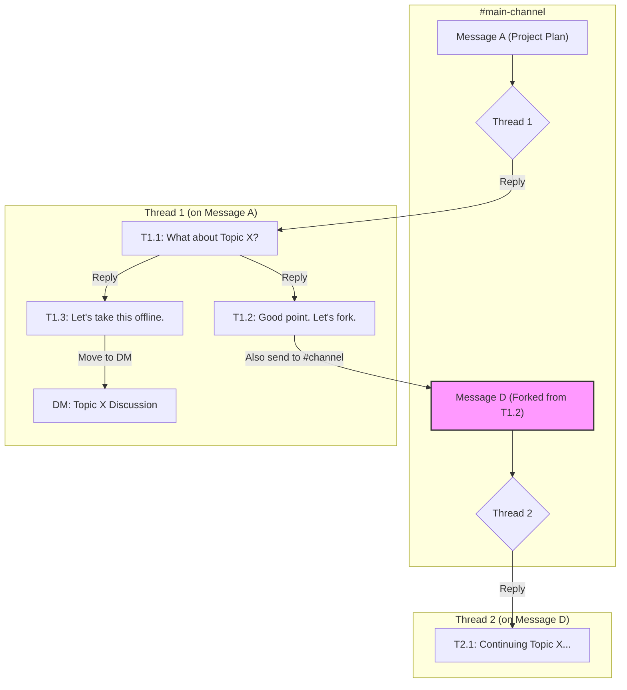
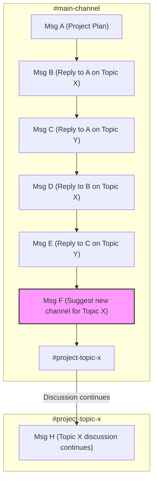

Replying in Slack is non-obvious for new users because its threading model differs fundamentally from other chat apps. While platforms like Discord use a linear, quote-reply flow, Slack sandboxes conversations into threads to maintain channel clarity for asynchronous work. This guide provides workflows for efficient replies and conversation management.

### Key Takeaways

*   **Use Threads for All Replies:** The standard workflow is to reply in threads (press `T`), not in the main channel. This keeps conversations organized and channels scannable.
*   **Manage Branched Conversations:** Use blockquotes (`>`) to reply to specific messages within a long thread. Use message links to reference messages from other channels.
*   **Fork Threads Intentionally:** When a side-topic becomes important, use the "Also send to #channel" checkbox to fork it into a new parent thread, making it visible to everyone.
*   **Use the "Threads" View as an Inbox:** The dedicated "Threads" view in the sidebar consolidates all your followed conversations, making it easy to track replies.
*   **Understand the "Why":** Slack's design prioritizes asynchronous work and reduces channel noise. This is a deliberate trade-off that has a steeper learning curve but results in more organized communication at scale.

### Standard Reply Workflow: Threads

Use threads for all replies; do not copy message links. The intended methods are faster and replies cannot be retroactively moved into a thread.

*   **Mouse:** Hover over a message. Click the "Reply in thread" icon.
*   **Keyboard:** Select a message with arrow keys. Press `T`.

#### Advanced Thread Management

*   **Use the "Threads" View:** The sidebar's "Threads" view aggregates all followed conversations into a single inbox for efficient tracking.
*   **Follow a Thread:** To monitor a conversation without replying, click the three-dot menu on a parent message and select "Follow thread." This adds it to your "Threads" view without sending a notification.

#### Anti-Pattern: Editing to Reply
Avoid replying in-channel and then editing the message to add an `@mention`. This action does not create a thread, fails to notify thread followers, and clutters the main channel.

### Managing Branched Conversations in a Thread

Manage context manually when a single thread contains multiple conversational branches, as Slack does not support nested threads.

#### Method 1: Block Quotes

Use blockquotes to reply to a specific, earlier message within the same thread.

1.  Copy text from the message you are referencing.
2.  In the reply box, type `>` followed by a space.
3.  Paste the copied text.
4.  Write your reply on a new line.

This method bundles the context directly with the reply.

#### Method 2: Message Links

Use this to reference a message from a different channel or from much earlier in a long thread. Copy the message link and paste it in your reply. Slack will unfurl it, providing a clickable link to the original context.

### Forking a Thread

Fork a thread when a side discussion evolves into a distinct topic. This moves the conversation into a new parent thread in the main channel.

#### Forking with "Also send to #channel"

To fork a thread, check the "Also send to #channel" box when replying.

1.  In the original thread, type the reply that will start the new topic.
2.  Check the "Also send to #channel" box below the input field.
3.  Send the message.

This action posts the reply as a new parent message in the main channel and notifies **everyone**, not just thread participants. Use this intentionally to surface a key update to the entire channel.

**Keyboard Navigation:** After typing your message, press `Shift+Tab` to focus the checkbox, then `Spacebar` to toggle it. Note that Slack often remembers the state of this checkbox for subsequent replies in the same session, so be mindful of its status.

#### Alternative Forking Methods

Use these when a sub-topic requires a smaller audience or becomes a self-contained project.

*   **Group DM:** For focused discussions (2-4 people). Announce the move in the original thread: "Moving this to a DM with @personA," and paste the original thread link for context.
*   **Temporary Private Channel:** For larger workstreams. Create a new channel (e.g., `#temp-project-feature`), announce the move, and post the original thread link for context.

### Manual Workflow: Simulating Replies with Links

A manual link-based workflow can simulate replies for users transitioning from other platforms. This method is keyboard-centric and pastes a direct link to the message being replied to.

1.  Navigate between panes (`Ctrl+F6` in the browser) to focus the channel or thread history.
2.  Use arrow keys to select the target message.
3.  Press `L` to copy the message URL to your clipboard.
4.  Navigate back to the message input box.
5.  Paste the URL (`Ctrl+V`) and type your message.

*(Note: This workflow can be further optimized with browser extensions. For example, a power user with a tool like Surfingkeys might use a visual mode shortcut (`v`) to select a message timestamp and then `y` to yank (copy) its URL, achieving the same result with fewer keystrokes. However, be aware that such extensions may override Slack's default keyboard shortcuts.)*

### Power User Tips for Discord Converts

These tips map common Discord power features to their Slack equivalents.

*   **Master the Quick Switcher (`Ctrl+K` or `Cmd+K`):** The fastest way to jump between channels, DMs, and workspaces.
*   **Customize Notifications with Keywords:** Configure keyword notifications for specific terms (e.g., a project codename) beyond per-channel settings.
*   **Embrace Asynchronous Status:** Use "Do Not Disturb" (DND) schedules to protect focus time. The culture prioritizes productivity over "online" status.
*   **Use Huddles for Quick Syncs:** Use Huddles for impromptu voice calls. They are temporary and end when the last person leaves.
*   **Leverage Advanced Search Modifiers:** Master search modifiers like `in:#channel-name`, `from:@username`, `has:link`, and date filters (`before:`, `after:`) to pinpoint information.
*   **Explore Slash Commands & Integrations:** Use built-in slash commands like `/remind` and explore the app directory for integrations like Google Drive or Jira.

### Market Context: Enterprise Hubs vs. Consumer Streams

Before comparing workflows, it's crucial to understand the market context. The two conversational models operate at vastly different scales and serve different primary purposes.

*   **Consumer Scale (Linear Stream):** Platforms like WhatsApp (projected 3.14B monthly active users in 2025) and Telegram (1B MAU) dominate the consumer space. Their linear, synchronous-first model is optimized for social connection.
*   **Enterprise Scale (Structured Hub):** Slack (projected 79M MAU in 2025) and its main competitor, Microsoft Teams, operate at a smaller user scale but are deeply entrenched in the high-value business market. Their success is not measured in raw user count but in paid adoption by organizations and their ability to function as a central productivity hub.

While consumer apps are now retrofitting thread-like features—a trend sometimes called the "Slack-ification" of chat—this divide in scale and core purpose explains the fundamental differences in their design philosophies.

*Source: Market data from Business of Apps, Statista (2024 projections for 2025).*

### Analysis: Native Threads vs. Manual Links

The choice between Slack's native threading and a manual link-based workflow is a trade-off between two design philosophies.

#### Native Threading Workflow

This is the standard workflow for experienced Slack users.

*   **Pros:**
    *   **High Signal-to-Noise Ratio:** Keeps main channels uncluttered and reserved for new topics, making them easy to scan.
    *   **Structured Notifications:** Notifies only thread participants, reducing noise for others in the channel.
    *   **Asynchronous-Friendly:** Aligns with an asynchronous work style where users catch up on specific, organized conversations.

*   **Cons:**
    *   **High Initial Cognitive Load:** Requires learning a new mental model for chat that differs from most other social messaging apps.
    *   **Conversation Siloing:** Important discussions can feel hidden from general view if not managed correctly.
    *   **Requires Team Discipline:** Only effective if the entire team consistently uses threads correctly.

#### Manual Link-Based Workflow

This workaround is for users transitioning from other platforms.

*   **Pros:**
    *   **Familiar Mental Model:** Directly maps to the "quote-reply" functionality common in platforms like Discord, lowering the initial barrier to use.
    *   **Explicit Context:** Provides a clear, clickable link to the exact message being referenced.

*   **Cons:**
    *   **Bypasses Thread Notifications:** Does not automatically notify the author of the original message in the same way a thread reply does.
    *   **Increased Channel Clutter:** Fills channels with URLs and out-of-context replies, making it harder to follow multiple conversations. This increases the effort for what HCI researchers call "information foraging."
    *   **Inefficient:** Requires more manual steps (navigate, select, copy, paste) than the native `T` keyboard shortcut.

### Workflow Comparison

<div class="comparison-table">

| Point        | Slack                                                                            | Discord                                                                      |
| :----------- | :------------------------------------------------------------------------------- | :--------------------------------------------------------------------------- |
| **Reply**    | Press `T` or hover to "Reply in thread". Sandboxes reply in a separate pane.       | Click "Reply". Posts a quoted reply in the main channel.                     |
| **Track**    | Automatic. Threads group conversations. Centralized in the "Threads" view.       | Manual. Requires scrolling or searching for mentions.                        |
| **Scan**     | Easy. Main channel shows only top-level posts.                                   | Difficult. Main channel is a mix of posts and all replies.                   |
| **Find**     | Centralized "Threads" view shows all your conversations.                         | Decentralized. Requires searching for `@mentions` across channels.           |
| **Alert**    | Use "Also send to #channel" to notify everyone of a key reply.                   | Use `@everyone` or `@here`.                                                  |
| **Reference**| Use blockquotes (`>`) for context in-thread or paste a message link.             | Reply to the old message; a link back is auto-added.                         |
| **Fork**     | Formal mechanism: "Also send to #channel" forks a reply into a new thread.       | No formal mechanism. Must start a new topic manually.                        |
| **Sub-Reply**| Not supported. Use blockquotes (`>`) to manually create visual hierarchy.        | Not supported. Replies are linear and push to the bottom.                    |
| **Switch**   | Efficient. The "Threads" view acts as an inbox for all active discussions.       | Inefficient. Requires manually navigating channels and scrolling.            |
| **Noise**    | Low by default. Notifications are thread-scoped, reducing interruptions.         | High by default. Notifications are channel-scoped.                           |
| **Onboarding**| Steeper learning curve due to unique threading model.                            | Intuitive, aligns with familiar social chat apps.                              |
| **Mindset**  | Asynchronous work hub. Channels are inboxes; threads are tasks.                  | Real-time social space. Channels are continuous streams of conversation.     |

</div>

### Visualizing Complex Conversation Flows

The structural differences between Slack and Discord are most apparent in complex conversations.

#### Slack: Structured Branching

Slack contains conversations in threads. Threads can be forked to new parent messages or moved to DMs, keeping the main channel clean while allowing structured sidebars.



#### Discord: Linear Chaos

Discord processes all messages in a single, chronological flow. Branching a topic requires manually creating a new channel, leading to intertwined discussions in the original channel.



### Design & Usability Analysis

The usability friction of Slack's threading model is explained by established HCI principles and validated by academic research.

**Mental Models & The Learning Curve:** A user's "mental model" is their understanding of how a system works. The linear, quote-reply model feels intuitive because it matches ubiquitous apps like WhatsApp. Slack's threading violates this common mental model, creating a "high initial cognitive load."

A foundational 2000 study from Microsoft Research confirmed this: users subjectively rated a threaded chat prototype significantly worse than a standard linear chat, finding it confusing because new messages could appear anywhere, breaking the single point of focus they were used to. However, their objective performance on a decision-making task was identical, and the threaded groups were more efficient, requiring fewer conversational turns to reach a decision (Smith et al., 2000).

**Interaction Cost & Asynchronous Efficiency:** This framework balances the effort to use a system (interaction cost) with the value of the information sought (information scent).

*   **Linear Chat:** Optimizes for the writer's convenience with a low initial interaction cost. This creates a high long-term cognitive cost for all other readers, who must manually reconstruct conversations from a chaotic stream where the "information scent" is weak.
*   **Threaded Chat:** Imposes a small, upfront interaction cost on the writer, who must consciously start a thread. This optimizes for all future readers by creating a low long-term cognitive cost. The 2000 study also found threading created more balanced participation, diminishing the "race to the floor" advantage that fast typists have in linear chat (Smith et al., 2000).

**Social Reciprocity & Coherence:** Threaded interfaces don't just organize content; they actively promote more focused dialogue. A 2017 study of a large social news site that switched from a linear to a threaded view found the change caused an "abrupt and significant increase in social reciprocity"—the rate of direct, back-and-forth replies. The explicit reply structure in the UI encouraged more coherent, dialogic exchanges (Arnaout & Gil, 2017).

### References

*   Arnaout, H. & Gil, R. (2017). *Get Back to Where You Belong: The Effect of Threads on User Conversation in an Online Community*. SSRN.
*   Smith, M., Cadiz, J.J., & Burkhalter, B. (2000). *Conversation Trees and Threaded Chat*. In Proceedings of the 2000 ACM conference on Computer supported cooperative work.

---

### Share on Twitter

Here are some suggested posts to share this article.

**Main Tweet:**
```text
A deep-dive into Slack's threading model vs. the linear replies of Discord/Telegram, covering workflows, power-user tips, and the design philosophy behind it.

https://kirilligum.com/blog/mastering-slack-reply-workflow/

#Slack #Productivity
```

**Reply 1 (Insight):**
```text
The core trade-off: Slack optimizes for a clean main channel (high signal-to-noise) at the cost of a steeper learning curve. Other apps optimize for real-time flow.

Understanding this is key to mastering Slack. #UI #UX #Design
```

**Reply 2 (Practical Tips):**
```text
My guide includes a full comparison table, diagrams of complex conversation flows, and a manual link-based reply workflow for those transitioning.

Plus, advanced tips like using the Quick Switcher (Ctrl+K) and search modifiers. #Tech #Workflow
```
