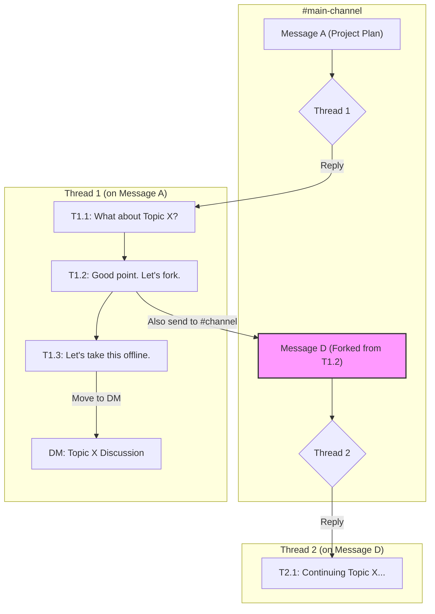
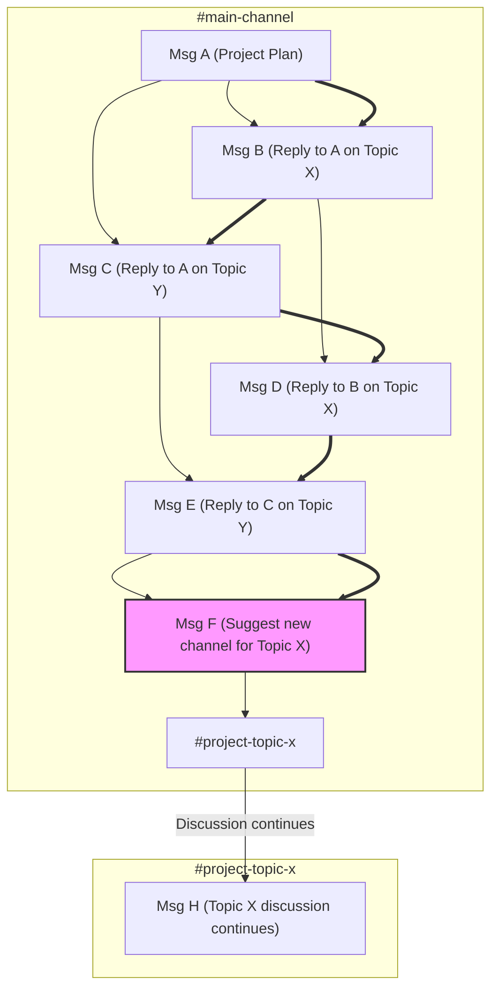

The design of a chat application's primary reply function is one of its most consequential choices, shaping user behavior and overall productivity. The market has overwhelmingly converged on the **Quote-Reply** model, used by Discord, WhatsApp, and nearly every other major platform. There is one significant outlier: Slack, whose **To-Parent** model represents a radical departure from convention.

This post argues that the Quote-Reply model is fundamentally superior for universal communication—including professional and enterprise use—because it aligns with natural human dialogue. The To-Parent model is not a competitor but a niche, high-effort tool for a different task entirely. Instead of making a familiar Quote-Reply user-friendly, Slack deliberately makes it difficult—requiring users to manually copy a message's URL and paste it—while making the "Also send to #{parent}" checkbox prominent and easily accessible. This design choice forces users to structure conversations into discrete components, much like software developers architecting code. For general communication, this is not a feature but a flaw that imposes a constant cognitive tax.

### Key Takeaways

*   **Quote-Reply is Superior for Communication:** The Quote-Reply model is the correct design for the vast majority of professional and personal communication because it is intuitive, fast, and supports the natural, free-flowing nature of human dialogue.
*   **To-Parent is a Niche Structuring Tool:** Slack's To-Parent model is not a better way to communicate; it is a high-effort tool for structuring information. Its purpose is to force users to act like librarians, filing each message into a predefined category.
*   **Continuous Cognitive Tax:** The To-Parent model's core flaw is the continuous cognitive tax it imposes. By forcing users to categorize every message *before* sending, it stifles expressiveness, reduces conversational velocity, and violates universal design principles.
*   **The Component Architecture Analogy:** The only domain where the To-Parent model makes sense is when the goal is to create a persistent, structured knowledge base, analogous to developers creating a component architecture in software. This is not communication; it is more similar to documentation.
*   **Market Dominance as Proof:** The overwhelming global dominance of the Quote-Reply model is not an accident. It is proof that users—including those in enterprise settings—prefer a tool that aids communication rather than one that forces premature organization.

### Market Reality: Universal Adoption vs. Niche Tooling

The market data is unequivocal: the Quote-Reply model is the globally dominant standard for digital communication.

*   **Universal Adoption (Quote-Reply):** Platforms like WhatsApp (projected 3.14B MAU in 2025) and Telegram (1B MAU), which use the intuitive Quote-Reply model, operate at a scale that demonstrates near-universal user preference. This model is the de facto standard for all forms of digital dialogue.
*   **Niche Tooling (To-Parent):** Slack's success in a high-value enterprise niche (projected 79M MAU in 2025) is not evidence of its model's superiority as a communication tool. Rather, it succeeded *despite* its less usable model by creating the "digital headquarters" category and benefiting from a first-mover advantage. By focusing on high-paying professional and enterprise customers—a stark contrast to the free or low-cost models of its consumer-focused competitors—it accelerated revenue growth and won on features like integrations and enterprise security, not on the merits of its core reply mechanic as a form of communication.

*Source: Market data from Business of Apps, Statista (2024 projections for 2025).*

### Comparing the Models: Communication vs. Structuring

| Point        | Quote-Reply Model (e.g., Discord)                                                               | To-Parent Model (e.g., Slack)                                                                 |
| :----------- | :---------------------------------------------------------------------------------- | :-------------------------------------------------------------------------------- |
| **Primary Goal** | **Communication.** Facilitate fast, intuitive, human-like dialogue.              | **Structuring.** Force creation of a structured knowledge base that is easier to follow if a specific slack-like style is used. |
| **Optimizes For** | **Writer's Speed.** Low friction to contribute. Encourages fast, reactive dialogue. | **Future Reader's Retrieval.** Enforces upfront organization.                     |
| **Cognitive Load** | Low for the writer. Higher for readers, who must mentally parse interleaved conversations and follow the conversational thread by clicking through quoted messages. | **High and continuous for the writer,** who must categorize every message. Easier to follow, but only for conversations that fit this thread-merging style. |
| **Core Use Case** | Brainstorming, decision-making, social chat—all forms of dialogue.              | Asynchronous status updates, Q&A, and task-specific documentation.                 |
| **Expressiveness** | High. The low friction encourages free-flowing, referential conversation.        | Lower. The structure stifles spontaneous thoughts that don't fit neatly.      |
| **Analogy** | A lively group conversation.                                                        | A physical filing cabinet or software component architecture.                     |
| **Primary Flaw** | **Requires Reader Focus.** In busy channels, readers must actively track conversations, similar to a real-life group discussion. | **Premature Organization.** Creativity is limited by enforcing structure too early.|
| **Usability** | Intuitive. Aligns with the dominant mental model from SMS and other social apps.  | Non-intuitive. Violates established mental models, requiring user re-training.    |

### Visualizing The Workflows

The structural differences are most apparent in complex conversations.

#### Slack: A Forest of Conversation Trees

A channel is a collection of conversation trees (threads). Each tree is isolated, preventing conversations from interfering with each other. Within a thread, replies form a flat, chronological list; there are no native nested replies. To create a direct link between replies, users must manually paste message links. This maintains clarity in the main channel view.

#### Discord: A Chronological Reply Graph

A channel is a single, chronologically ordered stream of messages (bold arrows). Replies create a directed graph structure (thin arrows), but all messages remain interleaved in the main view, leading to "context collapse" as conversations cross.

### Design Analysis: The Cost of Violating Convention

The usability friction of the To-Parent model is not a minor issue; it's a direct consequence of violating established design principles.

**Violating Mental Models (Don Norman):** The Quote-Reply model is intuitive because it matches the near-universal mental model for chat established by SMS, iMessage, and WhatsApp. Slack's To-Parent model directly contradicts this, forcing a "high initial cognitive load" on new users. More importantly, this is not a one-time cost. It's a continuous cognitive tax paid on every message, as the user must decide *how* and *where* to classify their communication before they can even write it.

**The Curse of Premature Optimization:** In software development, splitting code into components is powerful, but doing it too early, before the problem is understood, leads to bad abstractions and stifles development. The same applies here. A To-Parent model forces users to prematurely optimize their conversations into neat categories. This is fundamentally at odds with the messy, divergent nature of brainstorming and creative work, where the "chaos" of a free-flowing reply stream is a feature that allows for unexpected connections.

**A Critical Look at the Research:** The academic studies often cited in support of threads require a more critical reading:
*   The 2000 study (Smith et al.) found threaded groups used *fewer messages* to complete a task, but it crucially did not measure the *total time to completion* or the *time spent composing* each message. It's highly plausible that the cognitive overhead of threading forces users to spend more time crafting fewer, more "perfect" messages, potentially leading to no actual gain in overall efficiency and a significant loss in conversational velocity.
*   The 2017 study (Arnaout & Gil) showed increased "reciprocity" in a threaded view. While this indicates more focused dialogue, it does not mean it's universally better. It simply confirms that the UI successfully encourages a specific type of structured interaction, at the potential cost of other, more free-form types of communication.

The overwhelming market dominance of the Quote-Reply model suggests that for the majority of human communication, users prefer speed and expressiveness over upfront structure.

### References

*   Arnaout, H. & Gil, R. (2017). *Get Back to Where You Belong: The Effect of Threads on User Conversation in an Online Community*. SSRN.
*   Smith, M., Cadiz, J.J., & Burkhalter, B. (2000). *Conversation Trees and Threaded Chat*. In Proceedings of the 2000 ACM conference on Computer supported cooperative work.

---
For a practical guide on how to apply these concepts when moving from Discord to Slack, see the companion post: [A Discord User's Guide to Mastering Slack](/blog/migrating-from-discord-to-slack).

### Twitter (X.com) Thread

**Main Tweet**

Why is Quote-Reply (Discord, WhatsApp) superior to Slack's "Also send to #..." model for professional communication?

A thread on chat architecture, cognitive load, and why the market has chosen a clear winner for dialogue. 🧵

Read the full analysis: https://kirilligum.com/blog/quote-reply-superior-to-slack/

#Slack #Discord #UX #Design #Communication

---

**Replies**

1/ The two models serve different goals.

• Quote-Reply (intuitive, fast) is for **communication**.
• Slack's "To-Parent" model (high-effort) is for **structuring information**.

It’s the difference between a conversation and a filing cabinet.

---

2/ Slack's model imposes a continuous cognitive tax.

Before you can even type, you're forced to act as a librarian: "Is this a new topic? A reply? Which one?"

This friction stifles the natural, free-flowing speed of human dialogue.

---

3/ The "Curse of Premature Optimization."

Forcing structure on ideas too early kills creativity. The "chaos" of a Quote-Reply stream is a *feature* during brainstorming, allowing for unexpected connections.

Slack's model demands order before ideas have even formed.

---

4/ Market dominance is proof.

The overwhelming global preference for Quote-Reply isn't an accident. It proves users—including in enterprise—value tools that aid dialogue, not tools that force documentation.

Usability wins.

---

5/ When is Slack's model useful?

When the goal is to force the separation of conversations into discrete components. It's analogous to developers creating a component architecture in software—a deliberate, high-effort task for future clarity.

But it's building a knowledge base rather than free-form communication.
