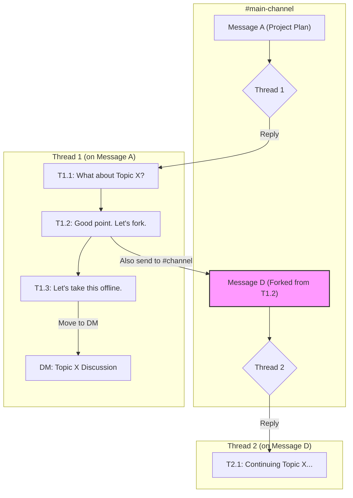
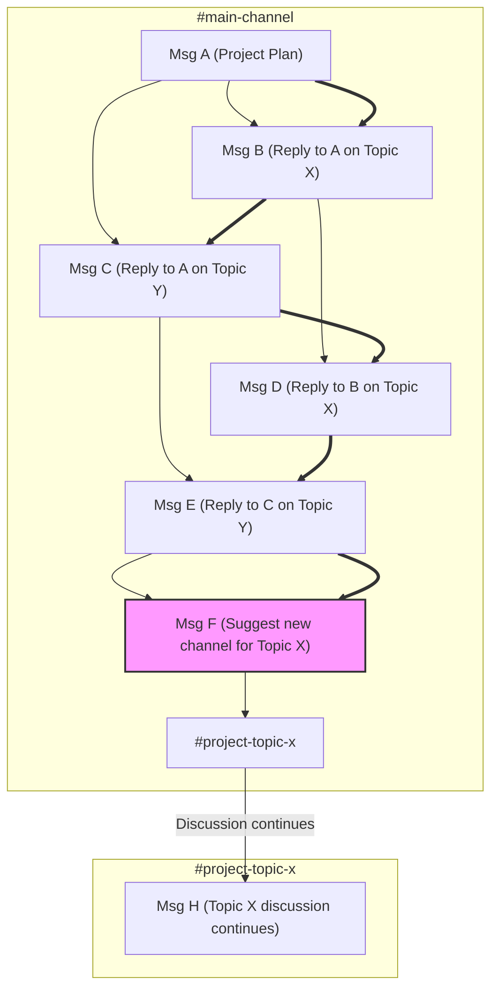

The design of a chat application's primary reply function is one of its most consequential choices, shaping user behavior, communication culture, and overall productivity. The market is defined by a fundamental design schism: the **Quote-Reply** model, dominant in apps like Discord and WhatsApp, and the **Thread-First** model pioneered by Slack. While most platforms now incorporate features from both, their default, primary workflow reveals a deep philosophical divide about what a chat application is for.

This post argues that neither model is inherently superior. Instead, they are tools optimized for different phases of the communication lifecycle: Quote-Reply for fast, expressive, and divergent brainstorming, and Thread-First for structured, convergent documentation.

### Key Takeaways

*   **It's About the Default:** The key differentiator is the primary, default reply action. Quote-Reply prioritizes low-friction contribution. Thread-First prioritizes upfront organization.
*   **The Communication Lifecycle:** Fast-flowing Quote-Reply chats excel at the messy, divergent phase of brainstorming. The deliberate, structured nature of Thread-First chats excels at the convergent phase of documenting decisions and creating a knowledge base.
*   **Cognitive Load is a Continuous Tax:** The Thread-First model doesn't just have a steep initial learning curve; it imposes a continuous cognitive tax, forcing users to categorize every message before sending it. This can stifle expressiveness and the natural flow of conversation.
*   **The Curse of Premature Optimization:** Enforcing the structure of a Thread-First model too early in the ideation process is a form of premature optimization, which can kill creativity. The "chaos" of a Quote-Reply stream is often a feature, not a bug, during this phase.
*   **Market Reality:** The Quote-Reply model is overwhelmingly dominant in terms of user adoption and global preference, as it aligns more closely with the natural, free-flowing patterns of human dialogue. Slack's Thread-First model has succeeded in a valuable enterprise niche by solving for asynchronous knowledge management, a different problem entirely.

### Market Reality: Social Scale vs. Enterprise Niche

The two design philosophies serve different markets and it's a mistake to compare their user numbers directly.

*   **Global Social Scale (Quote-Reply):** Platforms like WhatsApp (projected 3.14B monthly active users in 2025) and Telegram (1B MAU) operate at a massive, global scale. Their intuitive Quote-Reply model is the de facto standard for digital conversation because it mirrors the natural flow of human dialogue.
*   **Enterprise Niche (Thread-First):** Slack (projected 79M MAU in 2025) and its main competitor, Microsoft Teams, have secured a smaller but highly valuable enterprise market. Their success is not due to superior usability, but to solving a specific business problem: creating a persistent, searchable, and organized knowledge base for asynchronous teams.

*Source: Market data from Business of Apps, Statista (2024 projections for 2025).*

### Primary Action: The Core Trade-Off

| Point        | Discord (Quote-Reply)                                                               | Slack (Thread-First)                                                              |
| :----------- | :---------------------------------------------------------------------------------- | :-------------------------------------------------------------------------------- |
| **Primary Action** | Reply directly in the main, chronological stream.                                   | Reply in a sandboxed side-pane (a thread).                                        |
| **Optimizes For** | **Writer's Speed.** Low friction to contribute. Encourages fast, reactive dialogue. | **Future Reader's Clarity.** Enforces upfront organization for later retrieval.   |
| **Cognitive Load** | Low for the writer. High for readers, who must mentally parse interleaved conversations. | High for the writer, who must categorize their message *before* sending.          |
| **Communication Phase** | **Divergent Thinking.** Excellent for brainstorming, social chat, and live reactions. | **Convergent Thinking.** Excellent for Q&A, task-specific discussions, and documentation. |
| **Expressiveness** | High. The low friction encourages free-flowing, referential conversation.        | Lower. The structure can stifle spontaneous thoughts that don't fit neatly. |
| **Analogy** | A lively group conversation.                                                        | An organized meeting agenda with minutes.                                         |
| **Failure Mode** | **Context Collapse.** Important conversations become buried in noise.               | **Premature Organization.** Creativity is killed by enforcing structure too early.|
| **Onboarding** | Intuitive. Aligns with the dominant mental model from SMS and other social apps.  | Non-intuitive. Violates established mental models, requiring user re-training.    |

### Visualizing The Workflows

The structural differences are most apparent in complex conversations.

#### Slack: A Forest of Conversation Trees

A channel is a collection of conversation trees (threads). Each tree is isolated, preventing conversations from interfering with each other. Within a thread, replies form a flat, chronological list; there are no native nested replies. To create a direct link between replies, users must manually paste message links. This maintains clarity in the main channel view.

#### Discord: A Chronological Reply Graph

A channel is a single, chronologically ordered stream of messages (bold arrows). Replies create a directed graph structure (thin arrows), but all messages remain interleaved in the main view, leading to "context collapse" as conversations cross.

### Design & Usability Analysis

The usability friction of Slack's threaded forest model is explained by established HCI principles and validated by academic research.

**Mental Models & The Learning Curve:** A user's "mental model" is their understanding of how a system works. The reply-graph model, presented chronologically, feels intuitive because it matches ubiquitous apps like WhatsApp. Slack's threaded forest violates this common mental model, creating a "high initial cognitive load."

A foundational 2000 study from Microsoft Research confirmed this: users subjectively rated a threaded chat prototype significantly worse than a standard linear chat, finding it confusing because new messages could appear anywhere in the conversation tree, breaking the single point of focus they were used to. However, their objective performance on a decision-making task was identical, and the threaded groups were more efficient, requiring fewer conversational turns to reach a decision (Smith et al., 2000).

**Interaction Cost & Asynchronous Efficiency:** This framework balances the effort to use a system (interaction cost) with the value of the information sought (information scent).

*   **Reply Graph (Chronological View):** Optimizes for the writer's convenience with a low initial interaction cost. This creates a high long-term cognitive cost for all other readers, who must manually reconstruct conversations from a chaotic stream where the "information scent" is weak.
*   **Threaded Forest:** Imposes a small, upfront interaction cost on the writer (the act of starting a thread). This optimizes for all future readers by creating a low long-term cognitive cost. The 2000 study also found threading created more balanced participation, diminishing the "race to the floor" advantage that fast typists have in a purely linear chat (Smith et al., 2000).

**Social Reciprocity & Coherence:** Hierarchical, threaded interfaces don't just organize content; they actively promote more focused dialogue. A 2017 study of a large social news site that switched from a chronological view to a threaded, hierarchical view found the change caused an "abrupt and significant increase in social reciprocity"—the rate of direct, back-and-forth replies. The explicit tree structure in the UI encouraged more coherent, dialogic exchanges (Arnaout & Gil, 2017).

### References

*   Arnaout, H. & Gil, R. (2017). *Get Back to Where You Belong: The Effect of Threads on User Conversation in an Online Community*. SSRN.
*   Smith, M., Cadiz, J.J., & Burkhalter, B. (2000). *Conversation Trees and Threaded Chat*. In Proceedings of the 2000 ACM conference on Computer supported cooperative work.

---
For a practical guide on how to apply these concepts when moving from Discord to Slack, see the companion post: [A Discord User's Guide to Mastering Slack](/blog/migrating-from-discord-to-slack).
