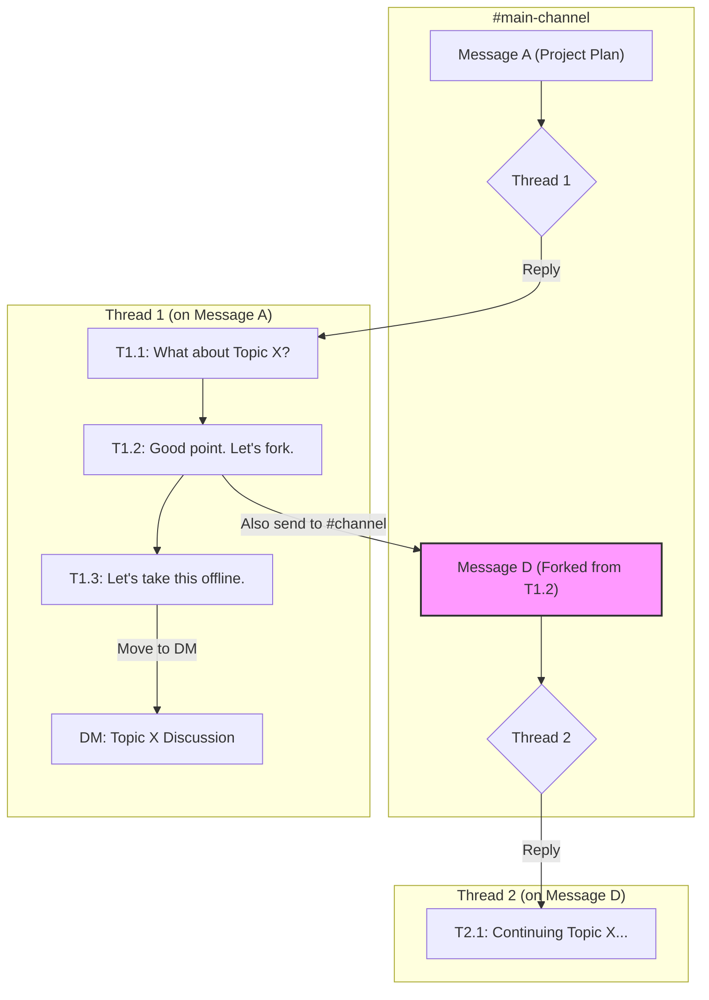
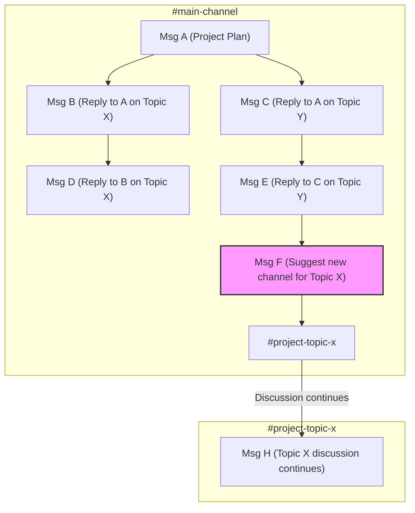

The architecture of a chat application's reply system fundamentally shapes user behavior and communication culture. From a computer science perspective, the market is split between two dominant paradigms: the 'threaded forest' model of Slack, and the 'reply graph' model common to platforms like Discord and WhatsApp. This post analyzes these two architectures, exploring the market data, design trade-offs, and academic research that explain their respective strengths and weaknesses.

### Key Takeaways

*   **Two Dominant Architectures:** The chat world is divided into asynchronous "threaded forests" (Slack) and synchronous "reply graphs" (Discord, WhatsApp). Each is optimized for different goals: persistent, structured knowledge work vs. ephemeral, free-flowing social connection.
*   **Market Validation for Both:** Consumer-focused reply-graph apps operate at a massive scale (billions of users). Enterprise-focused threaded-forest apps have smaller user bases but are deeply entrenched in the high-value business market, validated by paid adoption.
*   **Threading is Winning Influence:** The "Slack-ification" of chat, where consumer apps are adding thread-like features, signals a market-wide acknowledgment that a simple chronological stream with a flat reply structure breaks down at scale.
*   **Design Trade-offs are Intentional:** Threaded forests impose a higher initial learning curve but reduce long-term cognitive load by isolating conversations. Reply graphs presented chronologically are intuitive but create channel chaos as conversations become interleaved.
*   **Academic research confirms** that threaded, hierarchical interfaces foster more coherent, efficient, and reciprocal conversations, even if users initially find them less intuitive.

### Market Context: Enterprise Hubs vs. Social Streams

The two architectures serve different primary purposes and operate at vastly different scales.

*   **Consumer Scale (Reply Graph):** Platforms like WhatsApp (projected 3.14B monthly active users in 2025) and Telegram (1B MAU) dominate the consumer space. Their reply-graph model, presented as a single chronological stream, is optimized for synchronous social connection.
*   **Enterprise Scale (Threaded Forest):** Slack (projected 79M MAU in 2025) and its main competitor, Microsoft Teams, operate at a smaller user scale but are deeply entrenched in the high-value business market. Their success is measured in paid adoption by organizations that require structured, asynchronous communication.

*Source: Market data from Business of Apps, Statista (2024 projections for 2025).*

### Workflow Comparison

| Point        | Slack (Threaded Forest)                                                          | Discord (Reply Graph)                                                        |
| :----------- | :------------------------------------------------------------------------------- | :--------------------------------------------------------------------------- |
| **Structure**| A forest of conversation trees. Each top-level message can root a new tree.      | A single directed acyclic graph (DAG) of replies, presented chronologically. |
| **Reply**    | `T` key starts a new branch in a tree (a thread). Sandboxed from other trees.    | "Reply" adds a node and edge to the graph. Remains in the single stream.     |
| **Track**    | Automatic. Conversations are grouped by their root tree. Centralized in "Threads" view. | Manual. Requires scrolling or searching to trace edges in the graph.         |
| **Scan**     | Easy. Main channel shows only the roots of trees (top-level posts).              | Difficult. The single stream interleaves messages from all conversations.     |
| **Find**     | Centralized "Threads" view shows all trees you're part of.                       | Decentralized. Requires searching for mentions to find relevant nodes.       |
| **Alert**    | Use "Also send to #channel" to notify everyone of a key reply in a tree.         | Use `@everyone` or `@here` to ping all users in the channel.                 |
| **Fork**     | Formal mechanism: "Also send to #channel" forks a branch into a new root tree.   | No formal mechanism. Must start a new topic manually (a new orphan node).    |
| **Sub-Reply**| Not supported. All replies in a thread are siblings on the same level of the tree. | Not supported. The graph is flat; replies don't create nested depth.         |
| **Noise**    | Low by default. Notifications are scoped to a single tree (thread).              | High by default. Notifications are channel-scoped, covering the entire graph.|
| **Onboarding**| Steeper learning curve due to the tree/forest mental model.                      | Intuitive, as the chronological stream aligns with familiar chat apps.       |
| **Mindset**  | Asynchronous work hub. Channels are collections of topics (trees).               | Real-time social space. Channels are a continuous stream of conversation.    |

### Visualizing The Architectures

The structural differences are most apparent in complex conversations.

#### Slack: A Forest of Conversation Trees

A channel is a collection of conversation trees (threads). Each tree is isolated, preventing conversations from interfering with each other. Within a thread, replies form a flat, chronological list; there are no native nested replies. To create a direct link between replies, users must manually paste message links. This maintains clarity in the main channel view.

#### Discord: A Chronological Reply Graph

A channel is a single, chronologically ordered stream of messages. Replies create a directed graph structure, but all messages remain interleaved in the main view, leading to "context collapse" as conversations cross.

### Design & Usability Analysis

The usability friction of Slack's threaded forest model is explained by established HCI principles and validated by academic research.

**Mental Models & The Learning Curve:** A user's "mental model" is their understanding of how a system works. The reply-graph model, presented chronologically, feels intuitive because it matches ubiquitous apps like WhatsApp. Slack's threaded forest violates this common mental model, creating a "high initial cognitive load."

A foundational 2000 study from Microsoft Research confirmed this: users subjectively rated a threaded chat prototype significantly worse than a standard linear chat, finding it confusing because new messages could appear anywhere in the conversation tree, breaking the single point of focus they were used to. However, their objective performance on a decision-making task was identical, and the threaded groups were more efficient, requiring fewer conversational turns to reach a decision (Smith et al., 2000).

**Interaction Cost & Asynchronous Efficiency:** This framework balances the effort to use a system (interaction cost) with the value of the information sought (information scent).

*   **Reply Graph (Chronological View):** Optimizes for the writer's convenience with a low initial interaction cost. This creates a high long-term cognitive cost for all other readers, who must manually reconstruct conversations from a chaotic stream where the "information scent" is weak.
*   **Threaded Forest:** Imposes a small, upfront interaction cost on the writer (the act of starting a thread). This optimizes for all future readers by creating a low long-term cognitive cost. The 2000 study also found threading created more balanced participation, diminishing the "race to the floor" advantage that fast typists have in a purely linear chat (Smith et al., 2000).

**Social Reciprocity & Coherence:** Hierarchical, threaded interfaces don't just organize content; they actively promote more focused dialogue. A 2017 study of a large social news site that switched from a chronological view to a threaded, hierarchical view found the change caused an "abrupt and significant increase in social reciprocity"—the rate of direct, back-and-forth replies. The explicit tree structure in the UI encouraged more coherent, dialogic exchanges (Arnaout & Gil, 2017).

### References

*   Arnaout, H. & Gil, R. (2017). *Get Back to Where You Belong: The Effect of Threads on User Conversation in an Online Community*. SSRN.
*   Smith, M., Cadiz, J.J., & Burkhalter, B. (2000). *Conversation Trees and Threaded Chat*. In Proceedings of the 2000 ACM conference on Computer supported cooperative work.

---
For a practical guide on how to apply these concepts when moving from Discord to Slack, see the companion post: [A Discord User's Guide to Mastering Slack](/blog/migrating-from-discord-to-slack).
