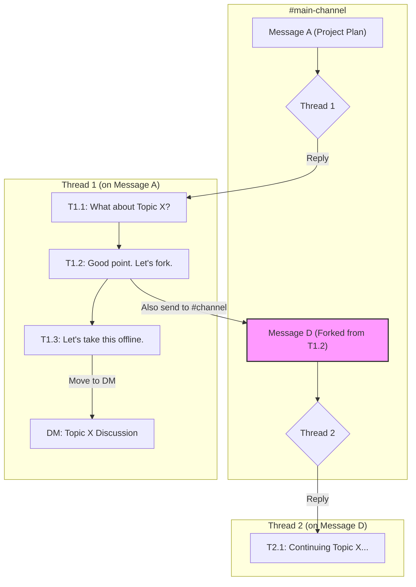
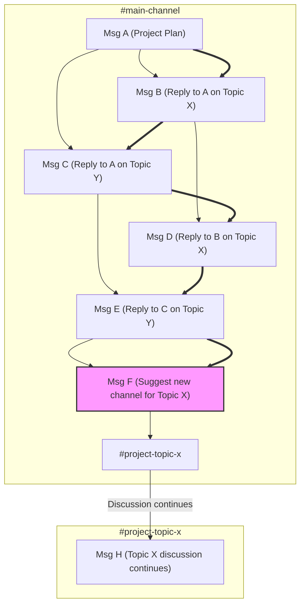

The design of a chat application's primary reply function is one of its most consequential choices, shaping user behavior, communication culture, and overall productivity. The market is defined by a fundamental design schism: the **Quote-Reply** model, dominant in apps like Discord and WhatsApp, and the **To-Parent** model pioneered by Slack. This design choice, named for its core "send to parent channel" action, is a significant departure from the norm. While most platforms now incorporate thread features, Slack's default workflow reveals a deep philosophical divide about what a chat application is for.

This post argues that while the Quote-Reply model is superior for universal communication, the To-Parent model serves as a specialized tool. It is not designed for general dialogue but for a specific phase of work: structuring conversations with deliberate effort, similar to how developers create component architectures in software.

### Key Takeaways

*   **It's About the Default:** The key differentiator is the primary reply action. Quote-Reply, the industry standard, prioritizes low-friction contribution. Slack's To-Parent model prioritizes upfront organization.
*   **The Communication Lifecycle:** Fast-flowing Quote-Reply chats are superior for the messy, divergent phase of brainstorming. The deliberate, structured nature of To-Parent chats is a niche tool for the convergent phase of documenting decisions.
*   **Cognitive Load is a Continuous Tax:** The To-Parent model doesn't just have a steep initial learning curve; it imposes a continuous cognitive tax, forcing users to categorize every message before sending it. This stifles the natural flow of conversation.
*   **The Curse of Premature Optimization:** Enforcing the structure of a To-Parent model during ideation is a form of premature optimization that kills creativity. The "chaos" of a Quote-Reply stream is a feature, not a bug, during this phase.
*   **Market Reality:** The Quote-Reply model is overwhelmingly dominant in terms of user adoption and global preference, as it aligns more closely with the natural, free-flowing patterns of human dialogue. Slack's To-Parent model has succeeded in a valuable enterprise niche by solving for structured, asynchronous knowledge management—a task fundamentally different from universal communication.

### Market Reality: Social Scale vs. Enterprise Niche

The two design philosophies serve different markets and it's a mistake to compare their user numbers directly.

*   **Global Social Scale (Quote-Reply):** Platforms like WhatsApp (projected 3.14B monthly active users in 2025) and Telegram (1B MAU) operate at a massive, global scale. Their intuitive Quote-Reply model is the de facto standard for digital conversation because it mirrors the natural flow of human dialogue.
*   **Enterprise Niche (To-Parent):** Slack (projected 79M MAU in 2025) and its main competitor, Microsoft Teams, have secured a smaller but highly valuable enterprise market. Their success is not due to superior usability, but to solving a specific business problem: creating a persistent, organized knowledge base for asynchronous teams.

*Source: Market data from Business of Apps, Statista (2024 projections for 2025).*

### Primary Action: The Core Trade-Off

| Point        | Discord (Quote-Reply)                                                               | Slack (To-Parent)                                                                 |
| :----------- | :---------------------------------------------------------------------------------- | :-------------------------------------------------------------------------------- |
| **Primary Action** | Reply directly in the main, chronological stream.                                   | Reply in a sandboxed side-pane (a thread).                                        |
| **Optimizes For** | **Writer's Speed.** Low friction to contribute. Encourages fast, reactive dialogue. | **Future Reader's Clarity.** Enforces upfront organization for later retrieval.   |
| **Cognitive Load** | Low for the writer. High for readers, who must mentally parse interleaved conversations. | High for the writer, who must categorize their message *before* sending.          |
| **Communication Phase** | **Divergent Thinking.** Excellent for brainstorming, social chat, and live reactions. | **Convergent Thinking.** Excellent for Q&A, task-specific discussions, and documentation. |
| **Expressiveness** | High. The low friction encourages free-flowing, referential conversation.        | Lower. The structure can stifle spontaneous thoughts that don't fit neatly. |
| **Analogy** | A lively group conversation.                                                        | An organized meeting agenda with minutes.                                         |
| **Failure Mode** | **Context Collapse.** Important conversations become buried in noise.               | **Premature Organization.** Creativity is killed by enforcing structure too early.|
| **Onboarding** | Intuitive. Aligns with the dominant mental model from SMS and other social apps.  | Non-intuitive. Violates established mental models, requiring user re-training.    |

### Visualizing The Workflows

The structural differences are most apparent in complex conversations.

#### Slack: A Forest of Conversation Trees

A channel is a collection of conversation trees (threads). Each tree is isolated, preventing conversations from interfering with each other. Within a thread, replies form a flat, chronological list; there are no native nested replies. To create a direct link between replies, users must manually paste message links. This maintains clarity in the main channel view.

#### Discord: A Chronological Reply Graph

A channel is a single, chronologically ordered stream of messages (bold arrows). Replies create a directed graph structure (thin arrows), but all messages remain interleaved in the main view, leading to "context collapse" as conversations cross.

### Design Analysis: The Cost of Violating Convention

The usability friction of the To-Parent model is not a minor issue; it's a direct consequence of violating established design principles.

**Violating Mental Models (Don Norman):** The Quote-Reply model is intuitive because it matches the near-universal mental model for chat established by SMS, iMessage, and WhatsApp. Slack's To-Parent model directly contradicts this, forcing a "high initial cognitive load" on new users. More importantly, this is not a one-time cost. It's a continuous cognitive tax paid on every message, as the user must decide *how* and *where* to classify their communication before they can even write it.

**The Curse of Premature Optimization:** In software development, splitting code into components is powerful, but doing it too early, before the problem is understood, leads to bad abstractions and stifles development. The same applies here. A To-Parent model forces users to prematurely optimize their conversations into neat categories. This is fundamentally at odds with the messy, divergent nature of brainstorming and creative work, where the "chaos" of a free-flowing reply stream is a feature that allows for unexpected connections.

**A Critical Look at the Research:** The academic studies often cited in support of threads require a more critical reading:
*   The 2000 study (Smith et al.) found threaded groups used *fewer messages* to complete a task, but it crucially did not measure the *total time to completion* or the *time spent composing* each message. It's highly plausible that the cognitive overhead of threading forces users to spend more time crafting fewer, more "perfect" messages, potentially leading to no actual gain in overall efficiency and a significant loss in conversational velocity.
*   The 2017 study (Arnaout & Gil) showed increased "reciprocity" in a threaded view. While this indicates more focused dialogue, it does not mean it's universally better. It simply confirms that the UI successfully encourages a specific type of structured interaction, at the potential cost of other, more free-form types of communication.

The overwhelming market dominance of the Quote-Reply model suggests that for the majority of human communication, users prefer speed and expressiveness over upfront structure.

### References

*   Arnaout, H. & Gil, R. (2017). *Get Back to Where You Belong: The Effect of Threads on User Conversation in an Online Community*. SSRN.
*   Smith, M., Cadiz, J.J., & Burkhalter, B. (2000). *Conversation Trees and Threaded Chat*. In Proceedings of the 2000 ACM conference on Computer supported cooperative work.

---
For a practical guide on how to apply these concepts when moving from Discord to Slack, see the companion post: [A Discord User's Guide to Mastering Slack](/blog/migrating-from-discord-to-slack).
