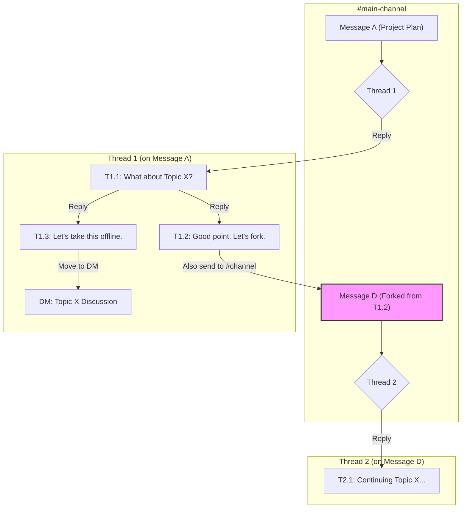
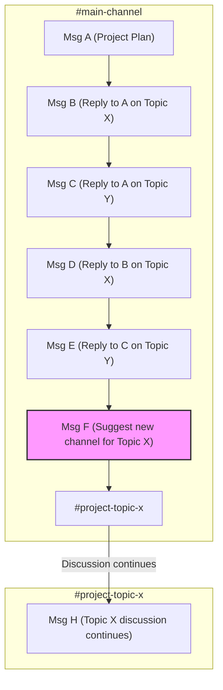

The design of a chat application's reply mechanism fundamentally shapes user behavior and communication culture. The market is split between two dominant paradigms: the sandboxed, asynchronous threads pioneered by Slack, and the linear, quote-reply stream common to platforms like Discord and WhatsApp. This post analyzes these two models, exploring the market data, design trade-offs, and academic research that explain their respective strengths and weaknesses.

### Key Takeaways

*   **Two Dominant Models:** The chat world is divided into asynchronous "work hubs" (Slack) and synchronous "social streams" (Discord, WhatsApp). Each is optimized for different goals: persistent knowledge work vs. ephemeral social connection.
*   **Market Validation for Both:** Consumer-focused linear chat apps operate at a massive scale (billions of users). Enterprise-focused threaded apps have smaller user bases but are deeply entrenched in the high-value business market, validated by paid adoption.
*   **Threading is Winning Influence:** The "Slack-ification" of chat, where consumer apps like WhatsApp are adding thread-like features, signals a market-wide acknowledgment that linear chat breaks down at scale.
*   **Design Trade-offs are Intentional:** Threading imposes a higher initial learning curve but reduces long-term cognitive load for all users by keeping channels clean. Linear chat is intuitive but creates channel chaos.
*   **Academic research confirms** that threaded interfaces foster more coherent, efficient, and reciprocal conversations, even if users initially find them less intuitive.

### Market Context: Enterprise Hubs vs. Consumer Streams

The two conversational models operate at vastly different scales and serve different primary purposes.

*   **Consumer Scale (Linear Stream):** Platforms like WhatsApp (projected 3.14B monthly active users in 2025) and Telegram (1B MAU) dominate the consumer space. Their linear, synchronous-first model is optimized for social connection.
*   **Enterprise Scale (Structured Hub):** Slack (projected 79M MAU in 2025) and its main competitor, Microsoft Teams, operate at a smaller user scale but are deeply entrenched in the high-value business market. Their success is not measured in raw user count but in paid adoption by organizations.

*Source: Market data from Business of Apps, Statista (2024 projections for 2025).*

### Workflow Comparison

| Point        | Slack                                                                            | Discord                                                                      |
| :----------- | :------------------------------------------------------------------------------- | :--------------------------------------------------------------------------- |
| **Reply**    | Press `T` or hover to "Reply in thread". Sandboxes reply in a separate pane.       | Click "Reply". Posts a quoted reply in the main channel.                     |
| **Track**    | Automatic. Threads group conversations. Centralized in the "Threads" view.       | Manual. Requires scrolling or searching for mentions.                        |
| **Scan**     | Easy. Main channel shows only top-level posts.                                   | Difficult. Main channel is a mix of posts and all replies.                   |
| **Find**     | Centralized "Threads" view shows all your conversations.                         | Decentralized. Requires searching for `@mentions` across channels.           |
| **Alert**    | Use "Also send to #channel" to notify everyone of a key reply.                   | Use `@everyone` or `@here`.                                                  |
| **Reference**| Use blockquotes (`>`) for context in-thread or paste a message link.             | Reply to the old message; a link back is auto-added.                         |
| **Fork**     | Formal mechanism: "Also send to #channel" forks a reply into a new thread.       | No formal mechanism. Must start a new topic manually.                        |
| **Sub-Reply**| Not supported. Use blockquotes (`>`) to manually create visual hierarchy.        | Not supported. Replies are linear and push to the bottom.                    |
| **Switch**   | Efficient. The "Threads" view acts as an inbox for all active discussions.       | Inefficient. Requires manually navigating channels and scrolling.            |
| **Noise**    | Low by default. Notifications are thread-scoped, reducing interruptions.         | High by default. Notifications are channel-scoped.                           |
| **Onboarding**| Steeper learning curve due to unique threading model.                            | Intuitive, aligns with familiar social chat apps.                              |
| **Mindset**  | Asynchronous work hub. Channels are inboxes; threads are tasks.                  | Real-time social space. Channels are continuous streams of conversation.     |

### Visualizing Complex Conversation Flows

The structural differences between Slack and Discord are most apparent in complex conversations.

#### Slack: Structured Branching

Slack contains conversations in threads. Threads can be forked to new parent messages or moved to DMs, keeping the main channel clean while allowing structured sidebars.

#### Discord: Linear Chaos

Discord processes all messages in a single, chronological flow. Branching a topic requires manually creating a new channel, leading to intertwined discussions in the original channel.

### Design & Usability Analysis

The usability friction of Slack's threading model is explained by established HCI principles and validated by academic research.

**Mental Models & The Learning Curve:** A user's "mental model" is their understanding of how a system works. The linear, quote-reply model feels intuitive because it matches ubiquitous apps like WhatsApp. Slack's threading violates this common mental model, creating a "high initial cognitive load."

A foundational 2000 study from Microsoft Research confirmed this: users subjectively rated a threaded chat prototype significantly worse than a standard linear chat, finding it confusing because new messages could appear anywhere, breaking the single point of focus they were used to. However, their objective performance on a decision-making task was identical, and the threaded groups were more efficient, requiring fewer conversational turns to reach a decision (Smith et al., 2000).

**Interaction Cost & Asynchronous Efficiency:** This framework balances the effort to use a system (interaction cost) with the value of the information sought (information scent).

*   **Linear Chat:** Optimizes for the writer's convenience with a low initial interaction cost. This creates a high long-term cognitive cost for all other readers, who must manually reconstruct conversations from a chaotic stream where the "information scent" is weak.
*   **Threaded Chat:** Imposes a small, upfront interaction cost on the writer, who must consciously start a thread. This optimizes for all future readers by creating a low long-term cognitive cost. The 2000 study also found threading created more balanced participation, diminishing the "race to the floor" advantage that fast typists have in linear chat (Smith et al., 2000).

**Social Reciprocity & Coherence:** Threaded interfaces don't just organize content; they actively promote more focused dialogue. A 2017 study of a large social news site that switched from a linear to a threaded view found the change caused an "abrupt and significant increase in social reciprocity"—the rate of direct, back-and-forth replies. The explicit reply structure in the UI encouraged more coherent, dialogic exchanges (Arnaout & Gil, 2017).

### References

*   Arnaout, H. & Gil, R. (2017). *Get Back to Where You Belong: The Effect of Threads on User Conversation in an Online Community*. SSRN.
*   Smith, M., Cadiz, J.J., & Burkhalter, B. (2000). *Conversation Trees and Threaded Chat*. In Proceedings of the 2000 ACM conference on Computer supported cooperative work.

---
For a practical guide on how to apply these concepts when moving from Discord to Slack, see the companion post: [A Discord User's Guide to Mastering Slack](/blog/migrating-from-discord-to-slack).
